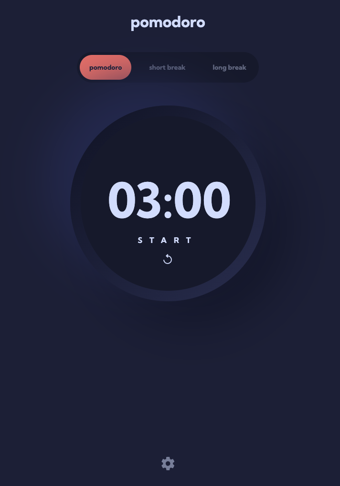

# Frontend Mentor - Pomodoro app solution

This is a solution to the [Pomodoro app challenge on Frontend Mentor](https://www.frontendmentor.io/challenges/pomodoro-app-KBFnycJ6G). Frontend Mentor challenges help you improve your coding skills by building realistic projects.

## Table of contents

- [Frontend Mentor - Pomodoro app solution](#frontend-mentor---pomodoro-app-solution)
  - [Table of contents](#table-of-contents)
  - [Overview](#overview)
    - [The challenge](#the-challenge)
    - [Screenshot](#screenshot)
    - [Links](#links)
  - [My process](#my-process)
    - [Built with](#built-with)
  - [Installation](#installation)
    - [Install dependencies](#install-dependencies)
    - [Run Application](#run-application)

## Overview

### The challenge

Users should be able to:

- Set a pomodoro timer and short & long break timers
- Customize how long each timer runs for
- See a circular progress bar that updates every minute and represents how far through their timer they are
- Customize the appearance of the app with the ability to set preferences for colors and fonts

### Screenshot



### Links

- Solution URL: [Repo](https://github.com/evertzner/pomodoro-app)
- Live Site URL: [Pomodoro App Site](https://pomodoro-esteban-vertzner.netlify.app/)

## My process

### Built with

- Astro
- Tailwind
- React

## Installation

### Install dependencies

```bash
npm install
```

### Run Application

```bash
npm run dev
```
